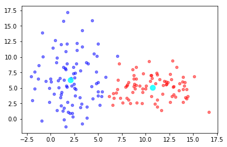

# Implementations of Machine Learning Algorithms 

# Table of Contents
1. [KMeans](#KMeans)

--------------
## KMeans
Imlementation of the KMeans algo

The objective is to minimize the cost function:

\begin{align}
J = \frac{1}{m} \sum_c \sum_k ( x_k ^c - \mu_k ^c)^2
\end{align}

<table style="border=0px solid #000"><tr><td>

</td><td>

</td>
</tr>
<tr><td>2 clusters dataset*</td><td>3 clusters dataset
</td></tr>
</table>

<table style="border=0px solid #000"><tr><td>

</td></tr>
</table>

---

*Contact:*
Let me know if you have questions/suggestions. Feel free to connect with me on [LinkedIn](https://www.linkedin.com/in/jmlbeaujour/).